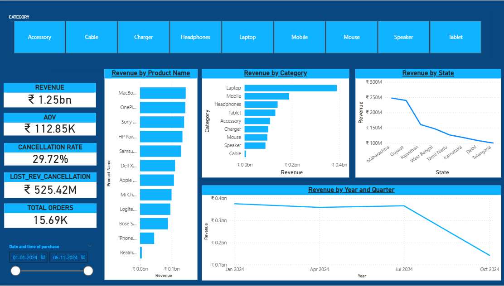

## Sales Dashboard

Project Overview:
This project is a Sales Analytics Dashboard built using Power BI.
It helps analyze sales performance, profit trends, and customer segments to support data-driven decision making.

Objectives:
The objective of this project is to:
Analyze total sales and profit,Identify top-performing products,Track regional sales performance,Understand customer purchasing behavior.

Dataset Information:
Dataset contains the following fields:
Order ID,Order Date,Customer Name,Product Category,Region,Sales,Profit,Quantity.

Tools Used:
Tools used in this project:
Power BI Desktop,Data cleaning,Data modeling,Data visualization.

## Dashboard Preview

